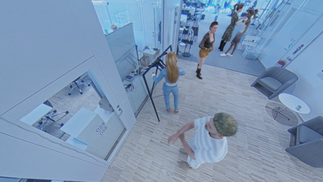
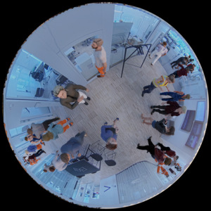
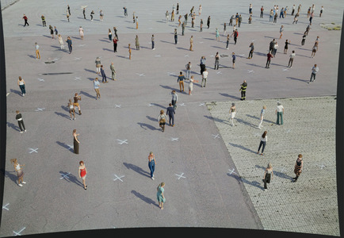
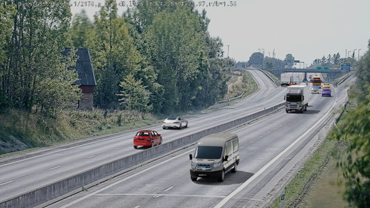

# Blenderset

Blenderset is tool for creating synthetic training data using blender. It can be used
to create random scenes consisting of a real background image, ontop of which random
humans and vehicles models are rendered with random lighting. In addition to the
rendered images, annotations are generated in form of pixelwise
instance-segmentations and bounding boxes. Here are a few example of images produced using blenderset:

[](example-images/office_realback.jpg)
[](example-images/fisheye_office.jpg)
[](example-images/nyhamnen.jpg)
[](example-images/real_highway.jpg)

## Installation

* Create a root directory and enter it: `mkdir blenderset; cd blenderset`
* Clone the repo: `git clone https://github.com/AxisCommunications/blenderset-addon.git`
* Create asset and metdata directories: `mkdir blenderset-assets blenderset-metadata`
* Install system-wide dependencies: `sudo apt install libopenexr-dev libimath-dev`
* Make sure you have `ldconfig` in your path. If not: `sudo ln -s /sbin/ldconfig /usr/local/bin/`
* Make the addon directory your cwd: `cd blenderset-addon`
* Create and initialize virtual environment: `. ./init_env.sh` (you might have to make
  sure that the file is executable with, for example `chmod 775 init_env.sh`)
* Install dependencies: `make sync_env`.
  Addons that crash will simply not show up in the GUI.
  If some packages can't be installed you can install them manually by running
  `sudo apt install apt-file` and then `sudo apt-file update`, and then you can seach for
  the missing packages using `apt-file search xxx` where xxx is the missing package.
  The missing package can then be installed by eg.
  `sudo apt install libavcodec-dev`
  `sudo apt install libswscale-dev`
* Enable the addons by either
   - `make run-enable_addons` (will fail before dependencies have been installed), or
   - using the blender GUI
      1. Use the menu: Edit/Preferences
      2. Find Add-ons in sidebar of popup
      3. Find the addon in e.g. using the search function
      4. Check the check-box in front of the addon to enable it


## Assets and Metadata

To use blender set custom assets and corresponding metadata are needed.
Depending on what kind of scenes are to be rendered, different types of assets
will be needed. By default, blenderset will look for assets in the
../blenderset-assets and ../blenderset-metadata directories. Some example metadata
for both free and paied asets are availible in example-assets and example-metadata,
which can either be copied to the above dirs or a config file can be placed in
`~/.config/blenderset/config.json` specifying which diretories to use. For example:

```json
{
    "metadata_dir": "/usr/local/src/blenderset/example-metadata",
    "assets_dir": "/usr/local/src/blenderset/example-assets"
}
```


### Real Backgrounds

Each background consist of:

* A camera image of an empty scene
* A camera model
* A region of interest (ROI) defining where to place pedestrians
* A set of tags used to filter out which backgrounds to use

These are specified in the `images_metadata.json` file. There is a helper script
`poly_roi.py` that can be used to create the ROI coordinates:
`python poly_roi.py --file image.jpg --roi-file roi.json`, which then needs to be
copied into `images_metadata.json`.


### Synthetic Backgrounds

Instead of using a real image as background, the ground plane can be textured with a
 downloaded material. Material can be found at for example
https://polyhaven.com/textures. Select blender as format and unpack the downloaded
zip-file in `example-assets/polyhaven`.


### HDRI Lighting

To light the scene HDRIs are used. They can be found at for example
https://polyhaven.com/hdris. Select format hdr and place the downloaded files in
`example-assets/skys`.


### Vehicles

To add vehicles to the scene, the comercial
[Transportation Addon](https://blendermarket.com/products/transportation) from
blender marked can be used. Install the addon manually and copy
`~/.config/blender/3.2/scripts/addons/Tranportation/data` to
`example-assets/Tranportation_data`.


### Humans

3D models of humans can be created in
[Reallusion Character Creator](https://www.reallusion.com/character-creator/)
or downloaded from [Actorcore](https://actorcore.reallusion.com/). Export them into
blender format and place them in
`example-assets/Character_Creator_v3.41/BlenderCharacters256`, and add an entry to
`example-metadata/character_metadata.json`.
Also, poses are needed
they can be extracted from animations downloaded from for example [Actorcore](https://actorcore.reallusion.com/).
Export them to blender as `.fbx` and place the files in
`example-assets/Character_Creator_v3.41/Animations/Avatar/<avatar>/`, where
`<avatar>` is a string specifying which characters the animation can be applied to by
looking for the same string in the `avatar_base` property of the character metadata.
Then import them using the `import_animation.py`,
which can be called by `make import_animations`.
This will update the metadata in `animations_metadata.json` and convert the `.fbx`
files into `.blend` files.

To try out the example `example-metadata/character_metadata.json` out of the box:

* Create an account at [Actorcore](https://actorcore.reallusion.com/) and log in
* "Buy" one or several of the free animations
* Go to Inventory in the top right menu
* Select "Motion" and the motion(s) to download and press "Download"
* Select the "Male Robot", check "Export motion only" and press "Next"
* Select "Blender" and press "DOWNLOAD"
* Extrax the zip file and move the .fbx files into `example-assets/Character_Creator_v3.41/Animations/Avatar/MaleRobot/`
* Run `make import_animations` in the blenderset-addon directory
* "Buy" the two free Actors `Party_M_0001` and `Party_F_0001`
* Go to Inventory in the top right menu
* Select "Actor", enable "Multiple Select", chooce the two  actors and press "Download"
* Move the two diretories `party-f-0001` and `party-m-0001` to example-assets/Character_Creator_v3.41/BlenderCharacters256/
* Start blender with `make interactive`
* Open the "Synthetic" tab on the right hand side of the 3D view
* Press one of the 3 top "Scenario" buttions
* If you want more Characters, press "Create" under "Characters"
* To move the characters and alter the pose, press "Update" under "Characters"
